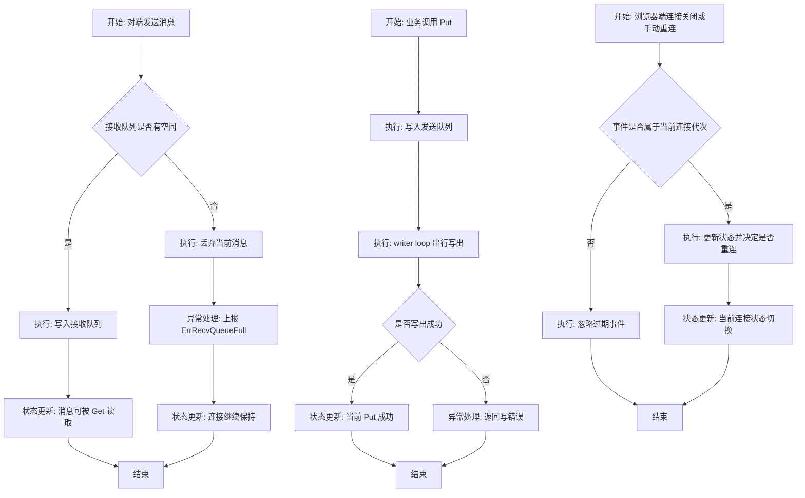

# WSS 消息压力与连接生命周期流程说明

## 1. 目标
- 要解决的问题:
  - 规范接收队列满、发送超时、重连切换时的行为。
- 成功标准:
  - 压力下无静默丢消息。
  - 单次调用超时不误伤整条连接。
  - 浏览器端重连状态不串线。
- 非目标:
  - 不提供端到端消息重试。

## 2. 边界
- 输入:
  - 客户端或服务端收到的 WebSocket 消息。
  - 业务层发起的 `Put()` 请求。
  - 浏览器侧连接关闭或重连动作。
- 输出:
  - 接收队列中的消息。
  - 显式错误回调。
  - 连接状态变更。
- 触发条件:
  - 收到消息。
  - 调用 `Put()`。
  - 连接关闭或手动重连。
- 参与方:
  - WebSocket 对端
  - Go 客户端
  - Go 服务端
  - 浏览器端客户端
  - 业务层消费者
- 前置条件:
  - 连接已建立。
  - 接收队列和发送队列已初始化。
- 约束:
  - 接收队列满时允许丢弃当前消息。
  - 丢弃必须显式上报错误。
  - 旧连接事件不得污染新连接状态。

## 3. 流程图

## 4. 主流程
1. 对端发送消息后，连接读取循环读取消息帧。
2. 读取循环尝试把消息放入接收队列。
3. 队列有空间时，消息进入接收队列，等待业务层 `Get()` 消费。
4. 业务层调用 `Put()` 时，消息进入发送队列。
5. writer loop 串行写出消息，并把结果回传给本次 `Put()`。
6. 浏览器端在连接切换时，仅当前连接代次可以推进状态。

## 5. 分支与异常
- 分支条件:
  - 接收队列是否已满。
  - 当前关闭事件是否属于活跃连接。
  - 发送是否在写超时内完成。
- 异常类型:
  - `ErrRecvQueueFull`
  - 写超时
  - read limit 超限
  - 连接正常关闭与异常关闭
- 补偿 / 重试 / 回滚:
  - 接收队列满时不重试当前消息。
  - 写失败时由调用方决定是否重试。
  - 浏览器端异常关闭时按重连策略重建连接。

## 6. 状态流转
- 初始状态:
  - Connecting
- 中间状态:
  - Opened
  - Closed
  - 当前消息已入发送队列
  - 当前消息已入接收队列
- 结束状态:
  - 消息成功被消费
  - 当前 `Put()` 返回成功
  - 当前消息被丢弃并已上报错误
  - 当前连接已切到新代次
- 非法状态:
  - 旧连接关闭事件修改新连接状态
  - 接收队列满但没有错误上报
  - 调用方 `Put()` 超时后整条连接被误关闭

## 7. 实现映射
- 入口:
  - [client.go](/._/lib/go/wss/client.go)
  - [serve.go](/._/lib/go/wss/serve.go)
  - [client.ts](/._/lib/go/wss/client.ts)
- 模块 / 服务:
  - Go 客户端读写循环
  - Go 服务端连接管理与广播
  - 浏览器端连接状态机
- 外部依赖:
  - `github.com/coder/websocket`
  - 本地 `stream` 包
- 数据对象 / 表 / 主题:
  - `writeRequest`
  - 接收 stream
  - 发送 stream
  - 浏览器端 `putQueue`

## 8. 验收与观测
- 验收标准:
  - 接收队列满时显式上报错误，连接仍保持。
  - `Put()` 超时仅影响当前调用。
  - 旧连接事件不会污染新连接状态。
  - 超大消息被 read limit 拦截。
- 关键日志:
  - 接收队列满日志。
  - 读写错误日志。
  - 浏览器端重连错误日志。
- 指标 / 告警:
  - `erred` 回调中的 `ErrRecvQueueFull` 计数。
  - 超大消息错误计数。
  - 重连失败计数。
- 回滚方式:
  - 可单独回滚接收压力语义、timeout 拆分、read limit、浏览器重连修复。
